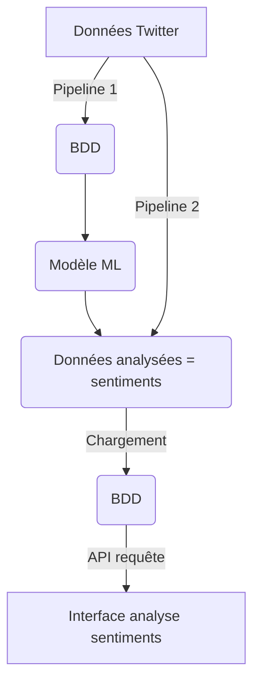

```mermaid
flowchart TD
    A[Données Twitter] -->|Pipeline 1| B(BDD)
    B --> C(Modèle ML)
    C --> I(Données analysées = sentiments)
    I --> |Chargement| J(BDD)
    A --> |Pipeline 2| I
    J -->|API requête| D[Interface analyse sentiments]
```  
